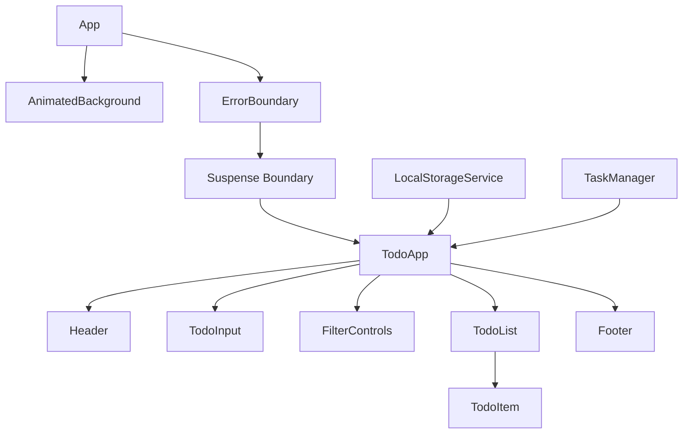

# Design Document: React 18 Todo App

## Overview

The React 18 Todo App is a modern task management application that showcases React 18's concurrent rendering capabilities, automatic batching, and Suspense features. The application provides a responsive, accessible interface for managing tasks while demonstrating performance optimizations through React 18's new concurrent features.

The design leverages React 18's concurrent renderer to maintain UI responsiveness during heavy operations, uses automatic batching for efficient state updates, and implements Suspense boundaries for graceful loading states. The application will be built with TypeScript for type safety and uses modern React patterns including hooks and functional components.

## Architecture

### Component Architecture



### Data Flow Architecture

The application follows a unidirectional data flow pattern with React 18's concurrent features:

1. **State Management**: Uses React's built-in state management with `useState` and `useReducer`
2. **Concurrent Updates**: Leverages `useTransition` for non-urgent updates (filtering, searching)
3. **Deferred Values**: Uses `useDeferredValue` for expensive computations (large list filtering)
4. **Automatic Batching**: React 18 automatically batches multiple state updates
5. **Suspense Integration**: Uses Suspense boundaries for loading states during data restoration

### React 18 Feature Integration

- **Concurrent Rendering**: Enables interruptible rendering for better responsiveness
- **Automatic Batching**: Groups multiple state updates for better performance
- **useTransition**: Marks non-urgent updates (search, filter) as low priority
- **useDeferredValue**: Defers expensive filtering operations
- **Suspense**: Handles loading states for data restoration and async operations
- **Strict Mode**: Enhanced development mode for detecting side effects

## Visual Design

### Animated Background Design

The application features a dynamic, animated background that creates a calming and engaging visual experience:

#### Background Composition
- **Base Color**: Clean white background (`#ffffff`)
- **Animated Elements**: Two large circular gradient elements
- **Color Palette**: 
  - Primary: Various shades of green (`#10b981`, `#34d399`, `#6ee7b7`)
  - Accent: Warm yellow tones (`#fbbf24`, `#fcd34d`, `#fde68a`)
  - Transitions: Smooth gradients between green and yellow

#### Animation Behavior
- **Movement Pattern**: Slow, continuous circular motion
- **Speed**: 20-30 second animation cycles for subtle, non-distracting movement
- **Gradient Flow**: Radial gradients that shift and blend as circles move
- **Opacity**: Semi-transparent overlays (30-50% opacity) to maintain text readability

#### CSS Implementation Strategy
```css
.animated-background {
  position: fixed;
  top: 0;
  left: 0;
  width: 100vw;
  height: 100vh;
  background: #ffffff;
  overflow: hidden;
  z-index: -1;
}

.gradient-orb {
  position: absolute;
  border-radius: 50%;
  filter: blur(40px);
  opacity: 0.4;
  animation: float 25s ease-in-out infinite;
}

.orb-1 {
  width: 400px;
  height: 400px;
  background: radial-gradient(circle, #10b981 0%, #fbbf24 50%, transparent 70%);
  top: -200px;
  left: -200px;
  animation-delay: 0s;
}

.orb-2 {
  width: 500px;
  height: 500px;
  background: radial-gradient(circle, #34d399 0%, #fcd34d 40%, transparent 70%);
  bottom: -250px;
  right: -250px;
  animation-delay: -12s;
}

@keyframes float {
  0%, 100% { transform: translate(0, 0) rotate(0deg); }
  25% { transform: translate(30px, -30px) rotate(90deg); }
  50% { transform: translate(-20px, 20px) rotate(180deg); }
  75% { transform: translate(-30px, -10px) rotate(270deg); }
}
```

#### Responsive Design Considerations
- **Mobile Optimization**: Smaller orb sizes and reduced blur for better performance
- **Reduced Motion**: Respect `prefers-reduced-motion` accessibility setting
- **Performance**: Use `transform` and `opacity` for GPU-accelerated animations

#### Accessibility and Performance
```css
/* Respect user's motion preferences */
@media (prefers-reduced-motion: reduce) {
  .gradient-orb {
    animation: none;
  }
}

/* Mobile optimization */
@media (max-width: 768px) {
  .orb-1 {
    width: 300px;
    height: 300px;
    filter: blur(30px);
  }
  
  .orb-2 {
    width: 350px;
    height: 350px;
    filter: blur(30px);
  }
}
```

#### Color Contrast Compliance
- Background maintains sufficient contrast with text elements
- Semi-transparent overlays ensure WCAG 2.1 AA compliance
- Alternative high-contrast mode available for accessibility needs

### Parallax Scroll Effects

The application implements subtle parallax scrolling effects to enhance the user experience:

#### Parallax Implementation
- **Text Elements**: Move at 0.5x scroll speed for gentle parallax effect
- **Background Elements**: Move at 0.3x scroll speed for depth perception
- **Performance**: Uses `transform3d` for hardware acceleration
- **Smooth Scrolling**: Throttled scroll events for optimal performance

#### CSS and JavaScript Integration
```css
.parallax-container {
  position: relative;
  overflow-x: hidden;
}

.parallax-text {
  transition: transform 0.1s ease-out;
  will-change: transform;
}

.parallax-background {
  transition: transform 0.15s ease-out;
  will-change: transform;
}

/* Smooth scrolling behavior */
html {
  scroll-behavior: smooth;
}

/* Respect reduced motion preferences */
@media (prefers-reduced-motion: reduce) {
  .parallax-text,
  .parallax-background {
    transform: none !important;
    transition: none;
  }
  
  html {
    scroll-behavior: auto;
  }
}
```

#### React Hook Implementation
```typescript
interface UseParallaxOptions {
  speed?: number;
  offset?: number;
}

const useParallax = ({ speed = 0.5, offset = 0 }: UseParallaxOptions = {}) => {
  const [scrollY, setScrollY] = useState(0);
  const elementRef = useRef<HTMLElement>(null);

  useEffect(() => {
    const handleScroll = throttle(() => {
      setScrollY(window.scrollY);
    }, 16); // ~60fps

    window.addEventListener('scroll', handleScroll, { passive: true });
    return () => window.removeEventListener('scroll', handleScroll);
  }, []);

  useEffect(() => {
    if (elementRef.current) {
      const yPos = -(scrollY * speed) + offset;
      elementRef.current.style.transform = `translate3d(0, ${yPos}px, 0)`;
    }
  }, [scrollY, speed, offset]);

  return elementRef;
};
```

## Components and Interfaces

### Core Components

#### App Component
```typescript
interface AppProps {}

const App: React.FC<AppProps> = () => {
  return (
    <>
      <AnimatedBackground />
      <ErrorBoundary>
        <Suspense fallback={<AppLoader />}>
          <TodoApp />
        </Suspense>
      </ErrorBoundary>
    </>
  );
};
```

#### AnimatedBackground Component
```typescript
interface AnimatedBackgroundProps {}

const AnimatedBackground: React.FC<AnimatedBackgroundProps> = () => {
  return (
    <div className="animated-background">
      <div className="gradient-orb orb-1" />
      <div className="gradient-orb orb-2" />
    </div>
  );
};
```

#### TodoApp Component (Main Container)
```typescript
interface TodoAppProps {}

interface TodoAppState {
  tasks: Task[];
  filter: FilterType;
  searchTerm: string;
  isLoading: boolean;
}

const TodoApp: React.FC<TodoAppProps> = () => {
  const [tasks, setTasks] = useState<Task[]>([]);
  const [filter, setFilter] = useState<FilterType>('all');
  const [searchTerm, setSearchTerm] = useState('');
  
  // React 18 concurrent features
  const [isPending, startTransition] = useTransition();
  const deferredSearchTerm = useDeferredValue(searchTerm);
  
  // Parallax effects for main content
  const headerRef = useParallax({ speed: 0.5 });
  const contentRef = useParallax({ speed: 0.3 });
  
  return (
    <div className="parallax-container">
      <header ref={headerRef} className="parallax-text">
        <Header />
      </header>
      <main ref={contentRef} className="parallax-background">
        {/* Main todo content */}
      </main>
    </div>
  );
};
```

#### Header Component with Parallax
```typescript
interface HeaderProps {}

const Header: React.FC<HeaderProps> = () => {
  const titleRef = useParallax({ speed: 0.6 });
  const subtitleRef = useParallax({ speed: 0.4 });
  
  return (
    <div className="header-container">
      <h1 ref={titleRef} className="parallax-text main-title">
        Todo App
      </h1>
      <p ref={subtitleRef} className="parallax-text subtitle">
        Powered by React 18
      </p>
    </div>
  );
};
```

#### TodoInput Component
```typescript
interface TodoInputProps {
  onAddTask: (description: string) => void;
  disabled?: boolean;
}

const TodoInput: React.FC<TodoInputProps> = ({ onAddTask, disabled }) => {
  // Input handling with validation
};
```

#### TodoItem Component
```typescript
interface TodoItemProps {
  task: Task;
  onToggle: (id: string) => void;
  onEdit: (id: string, description: string) => void;
  onDelete: (id: string) => void;
}

const TodoItem: React.FC<TodoItemProps> = ({ task, onToggle, onEdit, onDelete }) => {
  // Individual task rendering and interaction
};
```

#### FilterControls Component
```typescript
interface FilterControlsProps {
  currentFilter: FilterType;
  onFilterChange: (filter: FilterType) => void;
  taskCounts: TaskCounts;
}

const FilterControls: React.FC<FilterControlsProps> = ({ currentFilter, onFilterChange, taskCounts }) => {
  // Filter buttons and search input
};
```

### Service Interfaces

#### LocalStorageService
```typescript
interface LocalStorageService {
  saveTasks(tasks: Task[]): Promise<void>;
  loadTasks(): Promise<Task[]>;
  clearTasks(): Promise<void>;
}
```

#### TaskManager
```typescript
interface TaskManager {
  addTask(description: string): Task;
  updateTask(id: string, updates: Partial<Task>): Task;
  deleteTask(id: string): boolean;
  filterTasks(tasks: Task[], filter: FilterType, searchTerm: string): Task[];
}
```

#### ParallaxUtils
```typescript
interface ParallaxUtils {
  throttle<T extends (...args: any[]) => any>(func: T, delay: number): T;
  calculateParallaxOffset(scrollY: number, speed: number, offset?: number): number;
  isReducedMotionPreferred(): boolean;
}

// Throttle utility for scroll performance
const throttle = <T extends (...args: any[]) => any>(
  func: T,
  delay: number
): T => {
  let timeoutId: NodeJS.Timeout | null = null;
  let lastExecTime = 0;
  
  return ((...args: any[]) => {
    const currentTime = Date.now();
    
    if (currentTime - lastExecTime > delay) {
      func(...args);
      lastExecTime = currentTime;
    } else {
      if (timeoutId) clearTimeout(timeoutId);
      timeoutId = setTimeout(() => {
        func(...args);
        lastExecTime = Date.now();
      }, delay - (currentTime - lastExecTime));
    }
  }) as T;
};
```

## Data Models

### Task Model
```typescript
interface Task {
  id: string;
  description: string;
  completed: boolean;
  createdAt: Date;
  updatedAt: Date;
}
```

### Filter Types
```typescript
type FilterType = 'all' | 'active' | 'completed';

interface TaskCounts {
  total: number;
  active: number;
  completed: number;
}
```

### Application State
```typescript
interface AppState {
  tasks: Task[];
  filter: FilterType;
  searchTerm: string;
  isLoading: boolean;
  error: string | null;
}
```

## React 18 Concurrent Features Implementation

### Transition Usage
```typescript
// Non-urgent updates wrapped in transitions
const handleFilterChange = (newFilter: FilterType) => {
  startTransition(() => {
    setFilter(newFilter);
  });
};

const handleSearch = (term: string) => {
  setSearchTerm(term); // Urgent update for input responsiveness
  // Filtering will use deferred value for performance
};
```

### Deferred Values for Performance
```typescript
// Expensive filtering operations use deferred values
const deferredSearchTerm = useDeferredValue(searchTerm);
const filteredTasks = useMemo(() => {
  return TaskManager.filterTasks(tasks, filter, deferredSearchTerm);
}, [tasks, filter, deferredSearchTerm]);
```

### Suspense Boundaries
```typescript
// Data loading with Suspense
const DataProvider: React.FC<{ children: React.ReactNode }> = ({ children }) => {
  return (
    <Suspense fallback={<LoadingSpinner />}>
      <TaskDataLoader>
        {children}
      </TaskDataLoader>
    </Suspense>
  );
};
```

### Error Boundaries
```typescript
interface ErrorBoundaryState {
  hasError: boolean;
  error: Error | null;
}

class ErrorBoundary extends React.Component<
  { children: React.ReactNode },
  ErrorBoundaryState
> {
  // Error boundary implementation for graceful error handling
}
```

### Performance Optimizations

#### Parallax Scroll Performance
- **Hardware Acceleration**: Uses `transform3d` for GPU acceleration
- **Throttled Events**: Scroll events throttled to ~60fps (16ms intervals)
- **Passive Listeners**: Scroll event listeners marked as passive for better performance
- **Will-Change Property**: Applied to parallax elements for optimization hints
- **Reduced Motion Support**: Automatically disables parallax for users with motion sensitivity

#### React 18 Performance Features
- **Concurrent Rendering**: Maintains smooth parallax during heavy operations
- **Automatic Batching**: Groups scroll-triggered state updates efficiently
- **Time Slicing**: Prevents parallax calculations from blocking UI updates
- **Priority-Based Updates**: Scroll animations get appropriate priority levels

## Correctness Properties

*A property is a characteristic or behavior that should hold true across all valid executions of a system—essentially, a formal statement about what the system should do. Properties serve as the bridge between human-readable specifications and machine-verifiable correctness guarantees.*

### Task Management Properties

**Property 1: Task Addition Increases List Size**
*For any* valid (non-empty) task description, adding it to the task list should result in the task list growing by one and containing the new task.
**Validates: Requirements 1.1**

**Property 2: Empty Task Rejection**
*For any* string composed entirely of whitespace characters, attempting to add it as a task should be rejected, and the task list should remain unchanged.
**Validates: Requirements 1.2**

**Property 3: Edit Mode Activation**
*For any* task in the task list, clicking on its description should enable inline editing mode for that specific task.
**Validates: Requirements 1.3**

**Property 4: Task Update Completion**
*For any* task in edit mode and any valid description, saving the edit should update the task's description and exit editing mode.
**Validates: Requirements 1.4**

**Property 5: Task Deletion Removal**
*For any* task in the task list, clicking its delete button should remove that task from the list.
**Validates: Requirements 1.5**

### Status Management Properties

**Property 6: Completion Toggle**
*For any* task, clicking its checkbox should toggle its completion status (completed becomes incomplete, incomplete becomes completed).
**Validates: Requirements 2.1**

**Property 7: Completion Styling**
*For any* completed task, the rendered output should include visual styling that indicates completion.
**Validates: Requirements 2.2**

**Property 8: Incomplete Styling**
*For any* incomplete task, the rendered output should not include completion styling.
**Validates: Requirements 2.3**

**Property 9: Task Count Accuracy**
*For any* task list, the displayed counts should accurately reflect the actual number of completed and total tasks.
**Validates: Requirements 2.4**

### Data Persistence Properties

**Property 10: Task Addition Persistence**
*For any* valid task, adding it to the task list should result in the task being immediately stored in and retrievable from local storage.
**Validates: Requirements 3.1**

**Property 11: Task Modification Persistence**
*For any* task modification (description change, completion toggle), the updated task should be immediately reflected in local storage.
**Validates: Requirements 3.2**

**Property 12: Task Deletion Persistence**
*For any* task that is deleted, it should no longer exist in local storage after the deletion operation.
**Validates: Requirements 3.3**

**Property 13: Data Restoration Round Trip**
*For any* set of tasks, saving them to local storage and then loading the application should restore the exact same set of tasks.
**Validates: Requirements 3.4**

### React 18 Concurrent Features Properties

**Property 14: Automatic Batching**
*For any* sequence of multiple synchronous state updates, React 18 should automatically batch them into a single render cycle.
**Validates: Requirements 4.1, 7.4**

**Property 15: Async Loading States**
*For any* async operation, the application should display appropriate loading indicators without blocking user interactions.
**Validates: Requirements 5.2**

**Property 16: Loading to Content Transition**
*For any* successful data loading operation, the application should transition from loading state to displaying the loaded content.
**Validates: Requirements 5.3**

**Property 17: Error Handling**
*For any* error that occurs during loading or operations, the application should catch and display the error gracefully without crashing.
**Validates: Requirements 5.4**

### Filtering and Search Properties

**Property 18: Search Filtering**
*For any* search term and task list, the displayed tasks should only include those whose descriptions contain the search term (case-insensitive).
**Validates: Requirements 6.1**

**Property 19: All Filter Display**
*For any* task list, when the "All" filter is active, all tasks should be displayed regardless of their completion status.
**Validates: Requirements 6.2**

**Property 20: Active Filter Display**
*For any* task list, when the "Active" filter is active, only incomplete tasks should be displayed.
**Validates: Requirements 6.3**

**Property 21: Completed Filter Display**
*For any* task list, when the "Completed" filter is active, only completed tasks should be displayed.
**Validates: Requirements 6.4**

### Accessibility Properties

**Property 22: Keyboard Navigation**
*For any* interactive element, keyboard navigation should provide proper focus management and allow full functionality without mouse interaction.
**Validates: Requirements 8.1**

**Property 23: ARIA Labels**
*For any* interactive element, appropriate ARIA labels and roles should be present in the rendered output for screen reader compatibility.
**Validates: Requirements 8.2**

**Property 24: State Change Announcements**
*For any* task state change (completion toggle, addition, deletion), appropriate announcements should be made to assistive technologies.
**Validates: Requirements 8.3**

## Error Handling

### Error Boundary Strategy
The application implements a comprehensive error boundary system to handle React errors gracefully:

1. **Root Error Boundary**: Catches all unhandled errors in the component tree
2. **Suspense Error Boundaries**: Handle errors during data loading and async operations
3. **Local Storage Error Handling**: Graceful degradation when local storage is unavailable
4. **Network Error Handling**: Proper error states for any future network operations

### Error Recovery Mechanisms
- **Automatic Retry**: For transient errors like local storage failures
- **Fallback UI**: User-friendly error messages with recovery options
- **State Preservation**: Maintain user data when possible during error recovery
- **Development Logging**: Detailed error information in development mode

### Validation and Input Sanitization
- **Task Description Validation**: Prevent empty or invalid task descriptions
- **Input Sanitization**: Clean user input to prevent XSS and other security issues
- **Type Safety**: TypeScript interfaces ensure type correctness throughout the application

## Testing Strategy

### Dual Testing Approach
The application uses both unit tests and property-based tests for comprehensive coverage:

**Unit Tests**: Verify specific examples, edge cases, and error conditions
- Component rendering with specific props
- User interaction scenarios (click, keyboard input)
- Error boundary behavior with specific errors
- Local storage integration with mock data
- Accessibility compliance with specific ARIA attributes

**Property-Based Tests**: Verify universal properties across all inputs
- Task management operations with randomly generated tasks
- Filter and search functionality with random data sets
- State management consistency across random operation sequences
- React 18 concurrent feature behavior with various update patterns
- Data persistence round-trip properties with random task collections

### Property-Based Testing Configuration
- **Testing Library**: Use `@fast-check/jest` for property-based testing in Jest
- **Test Iterations**: Minimum 100 iterations per property test for thorough coverage
- **Test Tagging**: Each property test tagged with format: **Feature: react-18-todo-app, Property {number}: {property_text}**
- **Generator Strategy**: Smart generators that create realistic task data and user interaction patterns
- **Shrinking**: Automatic test case minimization when properties fail

### Testing Framework Integration
- **Jest**: Primary testing framework with React Testing Library
- **React Testing Library**: Component testing with user-centric approach
- **MSW (Mock Service Worker)**: Mock local storage and future API calls
- **Accessibility Testing**: `@testing-library/jest-dom` for accessibility assertions
- **Coverage Requirements**: Minimum 90% code coverage for core functionality

### Test Organization
```
src/
├── components/
│   ├── TodoApp/
│   │   ├── TodoApp.tsx
│   │   ├── TodoApp.test.tsx          # Unit tests
│   │   └── TodoApp.property.test.tsx # Property tests
│   └── TodoItem/
│       ├── TodoItem.tsx
│       ├── TodoItem.test.tsx
│       └── TodoItem.property.test.tsx
├── services/
│   ├── LocalStorageService.test.tsx
│   └── TaskManager.property.test.tsx
└── __tests__/
    ├── integration/
    └── properties/
```

Each correctness property will be implemented as a separate property-based test, ensuring that the application behavior matches the formal specification across all possible inputs and scenarios.